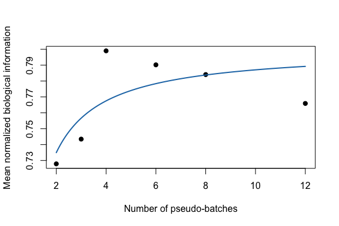
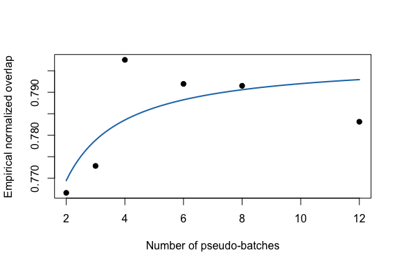

## Goal

This tutorial shows the batch-effect scaling law added from the GitHub
BMMC CITE-seq script:

`I = I_inf - C * log(1 - A / m)`

where `m` is the number of batches at fixed total cells.

The original script used paired RNA and ADT modalities. This lightweight
tutorial starts from the same compact count block as the other tutorials
and splits its features into two disjoint gene views. If the
repository-local Jurkat 10x block is available, the tutorial uses it;
otherwise it generates a small structured count matrix so the page
remains self-contained.

## Load real Jurkat counts and make two views

`batch_effect_mi()` estimates biological information from two
feature-by-cell matrices by computing cell-side subspaces and squared
canonical correlations.

    counts_file <- file.path(
      "..", "..", "..",
      "outputs", "exploration", "jurkat_glmpca_gaussian_snr_by_n",
      "jurkat_glmpca_counts_hvg.csv"
    )

    if (file.exists(counts_file)) {
      counts <- as.matrix(read.csv(counts_file, row.names = 1, check.names = FALSE))
      counts_source <- "Jurkat 10x HVG block"
    } else {
      counts <- make_tutorial_counts(seed = 11)
      counts_source <- "synthetic structured tutorial block"
    }

    counts_source
    #> [1] "synthetic structured tutorial block"
    dim(counts)
    #> [1]  400 5000

    view_a <- counts[seq_len(200), , drop = FALSE]
    view_b <- counts[201:400, , drop = FALSE]

    cells_demo <- sample(colnames(counts), 600)

    bio <- batch_effect_mi(
      view_a[, cells_demo, drop = FALSE],
      view_b[, cells_demo, drop = FALSE],
      r_x = 5,
      r_y = 5,
      transform_x = "log1p",
      transform_y = "log1p"
    )

    bio[c("mi", "mi_norm", "r_eff")]
    #> $mi
    #> [1] 3.558273
    #> 
    #> $mi_norm
    #> [1] 0.7116547
    #> 
    #> $r_eff
    #> [1] 5

The raw MI can be mapped to a bounded average-overlap scale:

    normalized_overlap <- function(mi, r) {
      1 - exp(-2 * mi / pmax(r, 1))
    }

    normalized_overlap(bio$mi, bio$r_eff)
    #> [1] 0.7590846

## Sampling cells by batch

`sample_batch_cells()` samples a balanced number of cells from each
selected batch. The Jurkat block does not come with experimental batch
labels, so we create pseudo-batches by ordering cells by UMI depth and
cutting them into equally sized groups. Real analyses should use an
experimental batch or donor column.

    cell_depth <- colSums(counts)
    batch_id <- cut(
      rank(cell_depth, ties.method = "first"),
      breaks = 12,
      labels = paste0("depth_batch_", seq_len(12))
    )

    meta <- data.frame(
      batch = as.character(batch_id),
      umi_in_hvg_block = cell_depth,
      row.names = colnames(counts)
    )

    sampled <- sample_batch_cells(
      meta = meta,
      batch_col = "batch",
      m_batch = 4,
      cells_per_batch = 80,
      seed = 1
    )

    head(sampled$cells)
    #> [1] "cell_3733" "cell_3359" "cell_2231" "cell_3793" "cell_1019" "cell_3455"
    sampled$batches
    #> [1] "depth_batch_6"  "depth_batch_12" "depth_batch_4"  "depth_batch_1"

## Fit the batch-number law

For each design point below, we sample cells from a fixed total of 480
cells and vary the number of batches.

    run_design <- function(m_batch, rep_id, n_total = 480) {
      cells_per_batch <- as.integer(n_total / m_batch)
      sampled <- sample_batch_cells(
        meta = meta,
        batch_col = "batch",
        m_batch = m_batch,
        cells_per_batch = cells_per_batch,
        seed = 1000 + 100 * rep_id + m_batch
      )
      bio <- batch_effect_mi(
        view_a[, sampled$cells, drop = FALSE],
        view_b[, sampled$cells, drop = FALSE],
        r_x = 5,
        r_y = 5,
        transform_x = "log1p",
        transform_y = "log1p"
      )
      data.frame(
        experiment = "fixed_n_vary_m",
        rep = rep_id,
        m_batch = m_batch,
        cells_per_batch = cells_per_batch,
        n_cells = length(sampled$cells),
        I_bio = bio$mi,
        I_bio_norm = bio$mi_norm,
        r_eff = bio$r_eff,
        I_bio_overlap = normalized_overlap(bio$mi, bio$r_eff)
      )
    }

    replicate_results <- do.call(
      rbind,
      lapply(seq_len(3), function(rep_id) {
        do.call(rbind, lapply(c(2, 3, 4, 6, 8, 12), run_design, rep_id = rep_id))
      })
    )

    summary_df <- summarize_batch_effect_results(replicate_results)
    overlap_summary <- aggregate(
      cbind(r_eff, I_bio_overlap) ~ experiment + m_batch + cells_per_batch + n_cells,
      data = replicate_results,
      FUN = mean
    )
    names(overlap_summary)[names(overlap_summary) == "r_eff"] <- "mean_r_eff"
    names(overlap_summary)[names(overlap_summary) == "I_bio_overlap"] <- "mean_I_bio_overlap"
    summary_df <- merge(
      summary_df,
      overlap_summary,
      by = c("experiment", "m_batch", "cells_per_batch", "n_cells"),
      sort = FALSE
    )
    summary_df
    #>       experiment m_batch cells_per_batch n_cells mean_I_bio   sd_I_bio
    #> 1 fixed_n_vary_m       2             240     480   3.639380 0.12469457
    #> 2 fixed_n_vary_m       3             160     480   3.717235 0.30116928
    #> 3 fixed_n_vary_m       4             120     480   3.995028 0.12045278
    #> 4 fixed_n_vary_m       6              80     480   3.950956 0.44982444
    #> 5 fixed_n_vary_m       8              60     480   3.920400 0.07807279
    #> 6 fixed_n_vary_m      12              40     480   3.829490 0.24726134
    #>     se_I_bio mean_I_bio_norm sd_I_bio_norm se_I_bio_norm n_rep_observed
    #> 1 0.07199244       0.7278760    0.02493891    0.01439849              3
    #> 2 0.17388016       0.7434469    0.06023386    0.03477603              3
    #> 3 0.06954345       0.7990057    0.02409056    0.01390869              3
    #> 4 0.25970626       0.7901913    0.08996489    0.05194125              3
    #> 5 0.04507535       0.7840801    0.01561456    0.00901507              3
    #> 6 0.14275640       0.7658980    0.04945227    0.02855128              3
    #>   mean_r_eff mean_I_bio_overlap
    #> 1          5          0.7665832
    #> 2          5          0.7728545
    #> 3          5          0.7975436
    #> 4          5          0.7919477
    #> 5          5          0.7915043
    #> 6          5          0.7831375

    batch_fit <- suppressWarnings(
      fit_batch_scaling(
        summary_df,
        law = "batch_number",
        target_col = "mean_I_bio_norm",
        min_points = 5
      )
    )

    coef(batch_fit)
    #>         I_inf             C             A 
    #>  8.000843e-01  1.626165e+02 -8.013218e-04
    summary(batch_fit)
    #>    type        model   x_col y_col n_points   ok message     I_inf        C
    #> 1 batch batch_number m_batch I_fit        6 TRUE      ok 0.8000843 162.6165
    #>               A        R2       RMSE        MAE
    #> 1 -0.0008013218 0.5162645 0.01779689 0.01453404
    predict(batch_fit, data.frame(m_batch = c(16, 24, 32)))
    #> [1] 0.7919403 0.7946549 0.7960122

The same batch-number law can also be fit to the bounded
normalized-overlap score.

    batch_overlap_fit <- suppressWarnings(
      fit_batch_scaling(
        summary_df,
        law = "batch_number",
        target_col = "mean_I_bio_overlap",
        min_points = 5
      )
    )

    coef(batch_overlap_fit)
    #>        I_inf            C            A 
    #>  0.797643208 42.588950118 -0.001324659
    summary(batch_overlap_fit)
    #>    type        model   x_col y_col n_points   ok message     I_inf        C
    #> 1 batch batch_number m_batch I_fit        6 TRUE      ok 0.7976432 42.58895
    #>              A       R2        RMSE         MAE
    #> 1 -0.001324659 0.520242 0.007646278 0.006212359
    predict(batch_overlap_fit, data.frame(m_batch = c(16, 24, 32)))
    #> [1] 0.7941174 0.7952926 0.7958802

## Plot biological information

    plot(batch_fit, xlab = "Number of pseudo-batches", ylab = "Mean normalized biological information")

## Plot empirical overlap

    plot(batch_overlap_fit, xlab = "Number of pseudo-batches", ylab = "Empirical normalized overlap")

## Cells per batch variant

The companion law uses fixed batch number and varies cells per batch:

`I = I_inf - C * log(1 + A / s)`

Use the same function with `law = "cells_per_batch"` and a
`cells_per_batch` column in the summary table.
