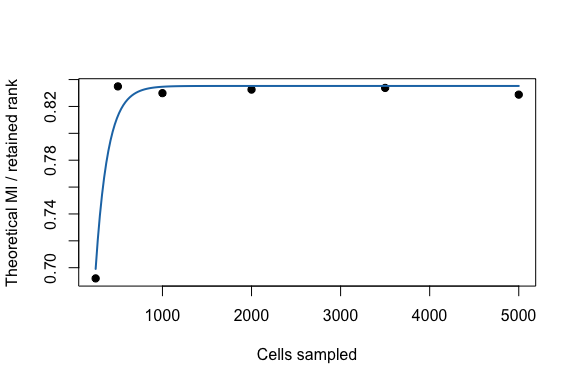
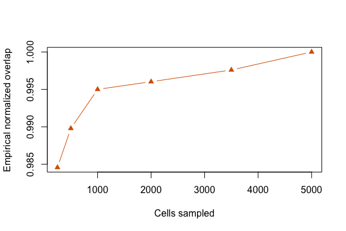

## Goal

This example asks how a spectral signal estimate changes as the number
of cells increases. It uses a compact 400-feature by 5,000-cell tutorial
count block. If the repository-local Jurkat 10x block is available, the
tutorial uses it; otherwise it generates a small structured count matrix
so the page remains self-contained.

The workflow is:

1.  load or generate the feature-by-cell count matrix;
2.  sample different numbers of cells;
3.  call `fit_cell_scaling()` to fit spectra across the grid;
4.  compare theoretical and empirical normalized overlap scores;
5.  use `predict()` to extrapolate to larger cell counts.

## Load real Jurkat counts

    counts_file <- file.path(
      "..", "..", "..",
      "outputs", "exploration", "jurkat_glmpca_gaussian_snr_by_n",
      "jurkat_glmpca_counts_hvg.csv"
    )

    if (file.exists(counts_file)) {
      counts <- as.matrix(read.csv(counts_file, row.names = 1, check.names = FALSE))
      counts_source <- "Jurkat 10x HVG block"
    } else {
      counts <- make_tutorial_counts(seed = 11)
      counts_source <- "synthetic structured tutorial block"
    }

    counts_source
    #> [1] "synthetic structured tutorial block"
    dim(counts)
    #> [1]  400 5000
    summary(colSums(counts))
    #>    Min. 1st Qu.  Median    Mean 3rd Qu.    Max. 
    #>   588.0   672.0   700.0   707.7   736.0  1011.0

The full source dataset contains many more cells when the Jurkat block
is available; this tutorial uses a compact HVG-like block so it renders
quickly.

    sample_summary_file <- file.path(
      "..", "..", "..",
      "outputs", "exploration", "jurkat_glmpca_gaussian_snr_by_n",
      "jurkat_glmpca_sample_summary.csv"
    )

    if (file.exists(sample_summary_file)) {
      sample_summary <- read.csv(sample_summary_file)
    } else {
      sample_summary <- data.frame(
        dataset = counts_source,
        n_total_cells = ncol(counts),
        sampled_cells = ncol(counts),
        n_genes_used = nrow(counts),
        mean_umi_per_cell = mean(colSums(counts))
      )
    }
    sample_summary[, c("dataset", "n_total_cells", "sampled_cells", "n_genes_used", "mean_umi_per_cell")]
    #>                               dataset n_total_cells sampled_cells n_genes_used
    #> 1 synthetic structured tutorial block          5000          5000          400
    #>   mean_umi_per_cell
    #> 1           707.651

## Fit the cell-number scaling object

`fit_cell_scaling()` computes the reference spectrum from the full
matrix, subsamples cells across `cell_grid`, computes theoretical MI
with `mi_theory()`, and fits a saturating curve to normalized MI.

    cell_fit <- fit_cell_scaling(
      counts,
      cell_grid = c(250, 500, 1000, 2000, 3500, 5000),
      n_features = 300,
      transform = "log1p",
      min_cells = 10,
      r = 8,
      R = 3,
      p_sim = 100,
      seed = 1
    )

    cell_fit$data
    #>   n_cells  mean_mi sd_mi se_mi mean_mi_norm sd_mi_norm se_mi_norm
    #> 1     250 5.536308    NA    NA    0.6920385         NA         NA
    #> 2     500 6.679359    NA    NA    0.8349199         NA         NA
    #> 3    1000 6.639256    NA    NA    0.8299071         NA         NA
    #> 4    2000 6.660337    NA    NA    0.8325421         NA         NA
    #> 5    3500 6.670289    NA    NA    0.8337861         NA         NA
    #> 6    5000 6.630332    NA    NA    0.8287914         NA         NA
    #>   mean_lambda1_over_mp_edge mean_n_spikes n_rep_observed    I_pred        resid
    #> 1                  3.746556             6              1 0.6990855 -0.007047036
    #> 2                  7.645568             8              1 0.8130535  0.021866394
    #> 3                  9.813722             7              1 0.8346619 -0.004754871
    #> 4                 12.116812            10              1 0.8352515 -0.002709360
    #> 5                 13.670369            11              1 0.8352519 -0.001465740
    #> 6                 14.251949            10              1 0.8352519 -0.006460444

## Empirical reference overlap

For a direct check, compare each subsampled RNA embedding with the full
RNA embedding using the same subspace-overlap MI formula. We normalize
both theoretical and empirical MI as `1 - exp(-2 * MI / r)`, which puts
the scores on the same bounded overlap scale.

    cell_grid <- c(250, 500, 1000, 2000, 3500, 5000)

    normalized_overlap <- function(mi, r) {
      1 - exp(-2 * mi / pmax(r, 1))
    }

    cell_embedding <- function(x, r = 8, n_features = 300, min_cells = 10) {
      features <- select_hvgs(x, n_features = n_features, min_cells = min_cells)
      right_singular_vectors(log1p(x[features, , drop = FALSE]), r = r)
    }

    z_full <- cell_embedding(counts, r = 8, n_features = 300, min_cells = 10)

    cell_empirical <- do.call(rbind, lapply(cell_grid, function(n_cells) {
      set.seed(1 + 10000L + n_cells)
      cells <- if (n_cells == ncol(counts)) colnames(counts) else sample(colnames(counts), n_cells)
      z_sub <- cell_embedding(counts[, cells, drop = FALSE], r = 8, n_features = 300, min_cells = 10)
      emp <- subspace_overlap_mi(z_sub, z_full)
      data.frame(
        n_cells = n_cells,
        empirical_mi = emp$mi,
        empirical_r_eff = emp$r_eff,
        empirical_overlap = normalized_overlap(emp$mi, emp$r_eff)
      )
    }))

    cell_compare <- merge(cell_fit$data, cell_empirical, by = "n_cells")
    cell_compare$theory_overlap <- normalized_overlap(cell_compare$mean_mi_norm, 1)
    cell_compare[, c("n_cells", "theory_overlap", "empirical_overlap", "mean_mi_norm", "empirical_mi", "empirical_r_eff")]
    #>   n_cells theory_overlap empirical_overlap mean_mi_norm empirical_mi
    #> 1     250      0.7494450         0.9845725    0.6920385     16.68642
    #> 2     500      0.8117228         0.9897867    0.8349199     18.33627
    #> 3    1000      0.8098257         0.9950035    0.8299071     21.19608
    #> 4    2000      0.8108253         0.9960286    0.8325421     22.11454
    #> 5    3500      0.8112954         0.9975931    0.8337861     24.11768
    #> 6    5000      0.8094009         1.0000000    0.8287914    110.52417
    #>   empirical_r_eff
    #> 1               8
    #> 2               8
    #> 3               8
    #> 4               8
    #> 5               8
    #> 6               8

## Inspect and extrapolate

The fitted object supports the usual R-style methods.

    coef(cell_fit)
    #>       I_inf           k 
    #> 0.835251890 0.007255423
    summary(cell_fit)
    #>   type      model   x_col        y_col n_points   ok message     I_inf
    #> 1 cell saturating n_cells mean_mi_norm        6 TRUE      ok 0.8352519
    #>             k        R2       RMSE         MAE
    #> 1 0.007255423 0.9631995 0.01001362 0.007383974
    predict(cell_fit, data.frame(n_cells = c(7500, 10000, 20000)))
    #> [1] 0.8352519 0.8352519 0.8352519

## Plot theory scaling law

    plot(cell_fit, xlab = "Cells sampled", ylab = "Theoretical MI / retained rank")

## Plot empirical overlap

    plot(
      cell_compare$n_cells,
      cell_compare$empirical_overlap,
      pch = 17,
      col = "#d95f02",
      type = "b",
      xlab = "Cells sampled",
      ylab = "Empirical normalized overlap"
    )

## Adapt to real data

Replace `counts` with another real feature-by-cell matrix or Seurat
object accepted by `find_eigenvalues()`. Keep the same cell grid loop,
then choose the response that best matches the biological question.
