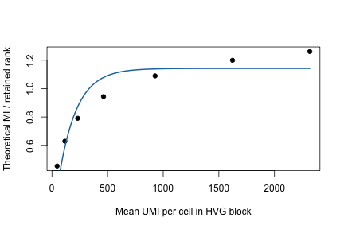

## Goal

This example asks how a spectral signal estimate changes with sequencing depth,
represented here as total UMI depth. It starts from the same real Jurkat 10x
HVG count block used in the cell-number tutorial.

The workflow is:

1. load a real feature-by-cell count matrix;
2. depth-subsample UMIs at several fractions;
3. call `fit_umi_scaling()` to fit spectra across the depth grid;
4. inspect `coef()`, `summary()`, and `plot()`;
5. use `predict()` to extrapolate to higher depth.

## Load real Jurkat counts


``` r
counts_file <- file.path(
  "..", "..", "..",
  "outputs", "exploration", "jurkat_glmpca_gaussian_snr_by_n",
  "jurkat_glmpca_counts_hvg.csv"
)

counts_full <- as.matrix(read.csv(counts_file, row.names = 1, check.names = FALSE))
dim(counts_full)
#> [1]  400 5000
summary(colSums(counts_full))
#>    Min. 1st Qu.  Median    Mean 3rd Qu.    Max. 
#>      77    1314    1944    2294    2861   21442
```

To keep rendering fast, use 3,000 cells from the 5,000-cell tutorial block.


``` r
cells_use <- sample(colnames(counts_full), 3000)
counts_base <- counts_full[, cells_use, drop = FALSE]
summary(colSums(counts_base))
#>    Min. 1st Qu.  Median    Mean 3rd Qu.    Max. 
#>      82    1306    1943    2317    2872   21442
```

## Fit the UMI-depth scaling object

`fit_umi_scaling()` binomially thins counts to each UMI fraction, compares each
downsampled spectrum to the full-depth reference with `mi_theory()`, and fits a
saturating curve to normalized MI.


``` r
umi_fit <- fit_umi_scaling(
  counts_base,
  umi_grid = c(0.02, 0.05, 0.1, 0.2, 0.4, 0.7, 1.0),
  n_cells = ncol(counts_base),
  n_features = 300,
  transform = "log1p",
  min_cells = 10,
  r = 8,
  R = 3,
  p_sim = 100,
  seed = 1
)

umi_fit$data
#>   mean_umi_per_cell   mean_mi sd_mi se_mi mean_mi_norm sd_mi_norm se_mi_norm
#> 1           46.4670  3.633146    NA    NA    0.4541432         NA         NA
#> 2          116.0313  5.032449    NA    NA    0.6290561         NA         NA
#> 3          231.6250  6.324499    NA    NA    0.7905623         NA         NA
#> 4          463.4467  7.548752    NA    NA    0.9435940         NA         NA
#> 5          927.0967  8.717384    NA    NA    1.0896730         NA         NA
#> 6         1622.5780  9.595680    NA    NA    1.1994600         NA         NA
#> 7         2317.3497 10.092073    NA    NA    1.2615092         NA         NA
#>   mean_lambda1_over_mp_edge mean_n_spikes n_rep_observed    I_pred       resid
#> 1                  9.938554            19              1 0.2872285  0.16691469
#> 2                 20.611851            17              1 0.5880582  0.04099792
#> 3                 35.587023            18              1 0.8726643 -0.08210191
#> 4                 60.580374            21              1 1.0787666 -0.13517265
#> 5                 99.200838            27              1 1.1388246 -0.04915156
#> 6                149.957418            34              1 1.1423139  0.05714608
#> 7                191.296562            40              1 1.1423597  0.11914948
```

## Inspect and extrapolate


``` r
coef(umi_fit)
#>       I_inf           k 
#> 1.142360293 0.006232299
summary(umi_fit)
#>   type      model             x_col        y_col n_points   ok message   I_inf
#> 1  umi saturating mean_umi_per_cell mean_mi_norm        7 TRUE      ok 1.14236
#>             k        R2     RMSE        MAE
#> 1 0.006232299 0.8626101 0.103117 0.09294776
predict(umi_fit, data.frame(mean_umi_per_cell = c(2500, 3500, 5000)))
#> [1] 1.14236 1.14236 1.14236
```

## Plot


``` r
plot(umi_fit, xlab = "Mean UMI per cell in HVG block", ylab = "Theoretical MI / retained rank")
```



## Adapt to real data

Use another real count matrix as `counts_full`, repeat the binomial thinning
across fractions and replicates, and store the response you want to model. The
spectral estimation pieces stay the same.
