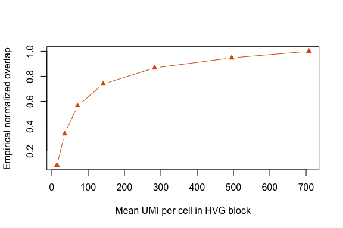

## Goal

This example asks how a spectral signal estimate changes with sequencing
depth, represented here as total UMI depth. It uses the same compact
tutorial count block as the cell-number tutorial. If the
repository-local Jurkat 10x block is available, the tutorial uses it;
otherwise it generates a small structured count matrix so the page
remains self-contained.

The workflow is:

1.  load or generate a feature-by-cell count matrix;
2.  depth-subsample UMIs at several fractions;
3.  call `fit_umi_scaling()` to fit spectra across the depth grid;
4.  compare theoretical and empirical normalized overlap scores;
5.  use `predict()` to extrapolate to higher depth.

## Load real Jurkat counts

    counts_file <- file.path(
      "..", "..", "..",
      "outputs", "exploration", "jurkat_glmpca_gaussian_snr_by_n",
      "jurkat_glmpca_counts_hvg.csv"
    )

    if (file.exists(counts_file)) {
      counts_full <- as.matrix(read.csv(counts_file, row.names = 1, check.names = FALSE))
      counts_source <- "Jurkat 10x HVG block"
    } else {
      counts_full <- make_tutorial_counts(seed = 11)
      counts_source <- "synthetic structured tutorial block"
    }

    counts_source
    #> [1] "synthetic structured tutorial block"
    dim(counts_full)
    #> [1]  400 5000
    summary(colSums(counts_full))
    #>    Min. 1st Qu.  Median    Mean 3rd Qu.    Max. 
    #>   588.0   672.0   700.0   707.7   736.0  1011.0

To keep rendering fast, use 3,000 cells from the 5,000-cell tutorial
block.

    cells_use <- sample(colnames(counts_full), 3000)
    counts_base <- counts_full[, cells_use, drop = FALSE]
    summary(colSums(counts_base))
    #>    Min. 1st Qu.  Median    Mean 3rd Qu.    Max. 
    #>   588.0   671.0   699.0   707.7   736.0  1011.0

## Fit the UMI-depth scaling object

`fit_umi_scaling()` binomially thins counts to each UMI fraction,
compares each downsampled spectrum to the full-depth reference with
`mi_theory()`, and fits a saturating curve to normalized MI.

    umi_fit <- fit_umi_scaling(
      counts_base,
      umi_grid = c(0.02, 0.05, 0.1, 0.2, 0.4, 0.7, 1.0),
      n_cells = ncol(counts_base),
      n_features = 300,
      transform = "log1p",
      min_cells = 10,
      r = 8,
      R = 3,
      p_sim = 100,
      seed = 1
    )

    umi_fit$data
    #>   mean_umi_per_cell   mean_mi sd_mi se_mi mean_mi_norm sd_mi_norm se_mi_norm
    #> 1          14.12567 0.3424942    NA    NA   0.04281177         NA         NA
    #> 2          35.44400 1.6875994    NA    NA   0.21094992         NA         NA
    #> 3          70.87500 2.8683091    NA    NA   0.35853864         NA         NA
    #> 4         141.37967 4.1286332    NA    NA   0.51607916         NA         NA
    #> 5         283.07800 5.3010467    NA    NA   0.66263084         NA         NA
    #> 6         495.36033 6.1530307    NA    NA   0.76912884         NA         NA
    #> 7         707.71000 6.6496282    NA    NA   0.83120352         NA         NA
    #>   mean_lambda1_over_mp_edge mean_n_spikes n_rep_observed     I_pred
    #> 1                  1.088042             4              1 0.07939472
    #> 2                  1.518732             6              1 0.18458528
    #> 3                  2.339279             6              1 0.32663382
    #> 4                  3.705266             6              1 0.51944313
    #> 5                  6.244449             7              1 0.70262365
    #> 6                  9.809512             7              1 0.78114642
    #> 7                 13.137967             9              1 0.79753534
    #>          resid
    #> 1 -0.036582951
    #> 2  0.026364638
    #> 3  0.031904817
    #> 4 -0.003363979
    #> 5 -0.039992815
    #> 6 -0.012017579
    #> 7  0.033668175

## Empirical reference overlap

For a direct check, compare each UMI-thinned RNA embedding with the
full-depth RNA embedding using the same subspace-overlap MI formula. We
normalize both theoretical and empirical MI as `1 - exp(-2 * MI / r)`,
which puts the scores on the same bounded overlap scale.

    umi_grid <- c(0.02, 0.05, 0.1, 0.2, 0.4, 0.7, 1.0)

    normalized_overlap <- function(mi, r) {
      1 - exp(-2 * mi / pmax(r, 1))
    }

    umi_embedding <- function(x, r = 8, n_features = 300, min_cells = 10) {
      features <- select_hvgs(x, n_features = n_features, min_cells = min_cells)
      right_singular_vectors(log1p(x[features, , drop = FALSE]), r = r)
    }

    thin_counts <- function(x, fraction) {
      matrix(
        rbinom(length(x), size = as.integer(x), prob = fraction),
        nrow = nrow(x),
        dimnames = dimnames(x)
      )
    }

    z_full <- umi_embedding(counts_base, r = 8, n_features = 300, min_cells = 10)

    umi_empirical <- do.call(rbind, lapply(umi_grid, function(frac) {
      set.seed(1 + 10000L + as.integer(round(frac * 10000)))
      counts_sub <- thin_counts(counts_base, frac)
      z_sub <- umi_embedding(counts_sub, r = 8, n_features = 300, min_cells = 10)
      emp <- subspace_overlap_mi(z_sub, z_full)
      data.frame(
        umi_fraction = frac,
        mean_umi_per_cell = mean(colSums(counts_sub)),
        empirical_mi = emp$mi,
        empirical_r_eff = emp$r_eff,
        empirical_overlap = normalized_overlap(emp$mi, emp$r_eff)
      )
    }))

    umi_compare <- merge(umi_fit$data, umi_empirical, by = "mean_umi_per_cell")
    umi_compare$theory_overlap <- normalized_overlap(umi_compare$mean_mi_norm, 1)
    umi_compare[, c("mean_umi_per_cell", "theory_overlap", "empirical_overlap", "mean_mi_norm", "empirical_mi", "empirical_r_eff")]
    #>   mean_umi_per_cell theory_overlap empirical_overlap mean_mi_norm empirical_mi
    #> 1          14.12567     0.08206027        0.08624355   0.04281177    0.3607648
    #> 2          35.44400     0.34420028        0.33836041   0.21094992    1.6521372
    #> 3          70.87500     0.51182302        0.56332049   0.35853864    3.3142229
    #> 4         141.37967     0.64376274        0.73818079   0.51607916    5.3604042
    #> 5         283.07800     0.73426659        0.86682620   0.66263084    8.0644009
    #> 6         495.36033     0.78524505        0.94720721   0.76912884   11.7655223
    #> 7         707.71000     0.81031814        1.00000000   0.83120352  110.5241730
    #>   empirical_r_eff
    #> 1               8
    #> 2               8
    #> 3               8
    #> 4               8
    #> 5               8
    #> 6               8
    #> 7               8

## Inspect and extrapolate

    coef(umi_fit)
    #>       I_inf           k 
    #> 0.801854792 0.007381272
    summary(umi_fit)
    #>   type      model             x_col        y_col n_points   ok message
    #> 1  umi saturating mean_umi_per_cell mean_mi_norm        7 TRUE      ok
    #>       I_inf           k        R2       RMSE        MAE
    #> 1 0.8018548 0.007381272 0.9885709 0.02913033 0.02627071
    predict(umi_fit, data.frame(mean_umi_per_cell = c(2500, 3500, 5000)))
    #> [1] 0.8018548 0.8018548 0.8018548

## Plot theory scaling law

    plot(umi_fit, xlab = "Mean UMI per cell in HVG block", ylab = "Theoretical MI / retained rank")

## Plot empirical overlap

    plot(
      umi_compare$mean_umi_per_cell,
      umi_compare$empirical_overlap,
      pch = 17,
      col = "#d95f02",
      type = "b",
      xlab = "Mean UMI per cell in HVG block",
      ylab = "Empirical normalized overlap"
    )

## Adapt to real data

Use another real count matrix as `counts_full`, repeat the binomial
thinning across fractions and replicates, and store the response you
want to model. The spectral estimation pieces stay the same.
